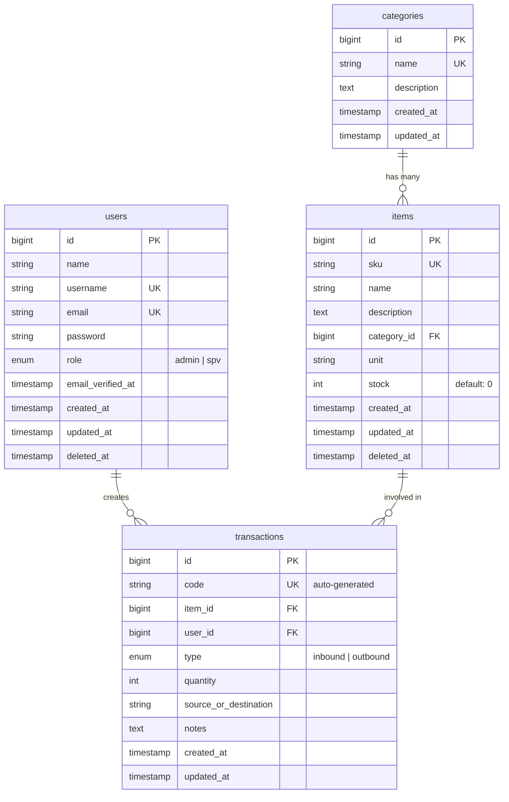

# Database Schema

Dokumen ini mendefinisikan skema database, relasi antar tabel, dan panduan migration/seeder untuk WilsonFlow.

---

## 1. Entity Relationship Diagram (ERD)



---

## 2. Table Definitions

### 2.1 `users`
Tabel pengguna sistem. Menggunakan Laravel's built-in migration sebagai basis.

| Column              | Type         | Constraints              | Notes                              |
|---------------------|--------------|--------------------------|------------------------------------|
| `id`                | `bigint`     | PK, auto-increment       |                                    |
| `name`              | `string`     | NOT NULL                 | Nama lengkap user                  |
| `username`          | `string`     | NOT NULL, UNIQUE         | Digunakan untuk login              |
| `email`             | `string`     | NOT NULL, UNIQUE         | Email user (untuk info, bukan login) |
| `password`          | `string`     | NOT NULL                 | Bcrypt hashed                      |
| `role`              | `enum`       | NOT NULL, default: `spv` | `admin` atau `spv` |
| `email_verified_at` | `timestamp`  | NULLABLE                 | Bawaan Laravel                     |
| `remember_token`    | `string(100)` | NULLABLE                | Bawaan Laravel                     |
| `created_at`        | `timestamp`  |                          |                                    |
| `updated_at`        | `timestamp`  |                          |                                    |
| `deleted_at`        | `timestamp`  | NULLABLE                 | Soft delete                        |

### 2.2 `categories`
Tabel kategori barang.

| Column        | Type       | Constraints       | Notes                       |
|---------------|------------|--------------------|-----------------------------|
| `id`          | `bigint`   | PK, auto-increment |                             |
| `name`        | `string`   | NOT NULL, UNIQUE   | Nama kategori (e.g., "Elektronik") |
| `description` | `text`     | NULLABLE           | Deskripsi opsional          |
| `created_at`  | `timestamp` |                   |                             |
| `updated_at`  | `timestamp` |                   |                             |

### 2.3 `items`
Tabel katalog barang.

| Column        | Type       | Constraints                    | Notes                              |
|---------------|------------|--------------------------------|------------------------------------|
| `id`          | `bigint`   | PK, auto-increment             |                                    |
| `sku`         | `string`   | NOT NULL, UNIQUE               | Auto-generated (e.g., `WLS-00001`) |
| `name`        | `string`   | NOT NULL                       | Nama barang                        |
| `description` | `text`     | NULLABLE                       | Deskripsi opsional                 |
| `category_id` | `bigint`   | FK → categories.id, NOT NULL   | Relasi ke kategori                 |
| `unit`        | `string`   | NOT NULL                       | Satuan (e.g., "pcs", "kg", "box")  |
| `stock`       | `integer`  | NOT NULL, default: 0, unsigned | Jumlah stok saat ini               |
| `created_at`  | `timestamp` |                               |                                    |
| `updated_at`  | `timestamp` |                               |                                    |
| `deleted_at`  | `timestamp` | NULLABLE                      | Soft delete                        |

### 2.4 `transactions`
Tabel log transaksi keluar masuk barang.

| Column                  | Type       | Constraints                  | Notes                                  |
|-------------------------|------------|------------------------------|----------------------------------------|
| `id`                    | `bigint`   | PK, auto-increment           |                                        |
| `code`                  | `string`   | NOT NULL, UNIQUE             | Auto-generated (e.g., `TRX-20260827-0001`) |
| `item_id`               | `bigint`   | FK → items.id, NOT NULL      | Barang yang bertransaksi               |
| `user_id`               | `bigint`   | FK → users.id, NOT NULL      | User yang mencatat transaksi           |
| `type`                  | `enum`     | NOT NULL                     | `inbound` atau `outbound`              |
| `quantity`              | `integer`  | NOT NULL, unsigned           | Jumlah barang yang masuk/keluar        |
| `source_or_destination` | `string`   | NOT NULL                     | Asal supplier (inbound) / tujuan kirim (outbound) |
| `notes`                 | `text`     | NULLABLE                     | Catatan opsional                       |
| `created_at`            | `timestamp` |                             |                                        |
| `updated_at`            | `timestamp` |                             |                                        |

---

## 3. Indexes

| Table          | Column(s)       | Type    | Notes                              |
|----------------|-----------------|---------|-------------------------------------|
| `users`        | `email`         | UNIQUE  | Untuk login                        |
| `items`        | `sku`           | UNIQUE  | Untuk identifikasi cepat          |
| `items`        | `category_id`   | INDEX   | Foreign key lookup                 |
| `transactions` | `code`          | UNIQUE  | Kode transaksi unik               |
| `transactions` | `item_id`       | INDEX   | Filter transaksi per barang        |
| `transactions` | `user_id`       | INDEX   | Filter transaksi per user          |
| `transactions` | `type`          | INDEX   | Filter berdasarkan tipe            |
| `transactions` | `created_at`    | INDEX   | Filter berdasarkan tanggal         |

---

## 4. Relationships (Eloquent)

```php
// User.php
public function transactions(): HasMany { return $this->hasMany(Transaction::class); }

// Category.php
public function items(): HasMany { return $this->hasMany(Item::class); }

// Item.php
public function category(): BelongsTo { return $this->belongsTo(Category::class); }
public function transactions(): HasMany { return $this->hasMany(Transaction::class); }

// Transaction.php
public function item(): BelongsTo { return $this->belongsTo(Item::class); }
public function user(): BelongsTo { return $this->belongsTo(User::class); }
```

---

## 5. Seeders (Data Demo untuk Sidang)

Seeder harus menyediakan data yang cukup agar dashboard terlihat hidup saat demo:

### 5.1 UserSeeder
| Nama              | Username       | Email                   | Role              | Password   |
|-------------------|----------------|-------------------------|-------------------|------------|
| Administrator     | admin          | admin@wilson.com        | admin             | password   |
| Budi Santoso      | budi.santoso   | budi@wilson.com         | spv    | password   |
| Siti Rahayu       | siti.rahayu    | siti@wilson.com         | spv    | password   |

### 5.2 CategorySeeder
- Elektronik
- Bahan Baku
- Spare Part
- Packaging
- Alat Tulis Kantor

### 5.3 ItemSeeder
- 15-20 item sample tersebar di berbagai kategori dengan stok bervariasi.
- SKU format: `WLS-00001`, `WLS-00002`, dst.

### 5.4 TransactionSeeder
- 30-50 transaksi sample (campuran inbound & outbound) dalam 30 hari terakhir.
- Dibuat oleh user berbeda agar dashboard terlihat realistis.

---

## 6. Migration Guidelines

- Satu migration file per perubahan logis.
- Gunakan `$table->softDeletes()` pada tabel yang memerlukan soft delete.
- Gunakan `$table->foreignId('xxx_id')->constrained()->cascadeOnDelete()` untuk foreign keys yang harus ikut terhapus, atau `->restrictOnDelete()` untuk yang harus dicegah.
- Selalu jalankan `php artisan migrate:fresh --seed` setelah perubahan migration untuk memastikan semuanya clean.

